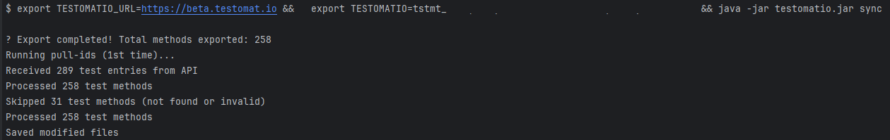

# Java-Check-Tests

Command-line interface for the Testomat.io Java Reporter library.

## Usage

This CLI tool can be used to:

- Import your test source code to Testomat.io
- Sync test IDs between Testomat.io porject and your codebase
- Remove test IDs when needed

---

## Supported frameworks
| Framework |  Status  |
|-----------|:--------:|
| TestNG    |    ✅     |
| JUnit     |    ✅     |

> New frameworks support will be added soon.

---

## Commands

### `import`

Imports the code of your test methods to the testomat.io.

Use this command before running tests to see the code and have proper package structure in the UI.  
Will dry run if apikey is not provided.

>**Options:**
>- `--apikey` / `-key` - Your Testomat.io project API key (required)
>- `--url` - Server URL, e.g. https://app.testomat.io (required)
>- `--directory` / `-d` - Directory to scan (optional, defaults to current directory)
>- `--verbose` / `-v` - Enable verbose output (optional)
>- `--dry-run` - Show what would be exported without sending (optional)


### `sync`

Executes tests code to the Testomat.io and pull new/updated IDs from the server into your codebase.

Convenience command for typical workflow.

>**Alias** `update-ids`

>**Options:**
>- `--apikey` / `-key` - Your Testomat.io project API key (required)
>- `--url` - Server URL (required)
>- `--directory` / `-d` - Directory to scan (optional, defaults to current directory)

**Please note:** if not all the tests have been annotated with @TestId after the sync command -  
simply rerun the command.

### Test class before sync
```java
    package com.library.model.junit.parameterizedtests;
    
    import org.junit.jupiter.params.ParameterizedTest;
    import org.junit.jupiter.params.provider.CsvFileSource;
    import static org.junit.jupiter.api.Assertions.*;
    
    public class CsvFileSourceParameterizedTests {

        @ParameterizedTest
        @CsvFileSource(resources = "/com/library/model/junit/parameterizedtests/users.csv", numLinesToSkip = 1)
        void testUserDataValidation(String username, int age, String email) {
            assertNotNull(username);
            assertNotNull(email);
            assertTrue(age > 0);
            assertTrue(username.length() >= 3);
            assertTrue(email.contains("@"));
            assertTrue(age >= 18);
        }
    }
```
### Sync console report


### Sync result
```java
    package com.library.model.junit.parameterizedtests;
    
    import static org.junit.jupiter.api.Assertions.*;
    
    import io.testomat.core.annotation.TestId; // <== Import added
    import org.junit.jupiter.params.ParameterizedTest;
    import org.junit.jupiter.params.provider.CsvFileSource;
    
    public class CsvFileSourceParameterizedTests {
    
        @ParameterizedTest
        @CsvFileSource(resources = "/com/library/model/junit/parameterizedtests/users.csv", numLinesToSkip = 1)
        @TestId("d32625e6")  // <== TestId added(or updated)
        void testUserDataValidation(String username, int age, String email) {
            assertNotNull(username);
            assertNotNull(email);
            assertTrue(age > 0);
            assertTrue(username.length() >= 3);
            assertTrue(email.contains("@"));
            assertTrue(age >= 18);
        }
    }    
```

### `clean-ids`

Removes `@TestId` annotations and related imports from all classes in the directory recursively.  
**Runs locally only**

>**Options:**
>- `--directory` / `-d` - Directory to clean (optional, defaults to current directory)
>- `--verbose` / `-v` - Enable verbose output (optional)
>- `--dry-run` - Show what would be removed without making changes (optional)

---

## Examples

>Note: The CLI will search for the test methods recursively from the location where testomatio.jar is.
>If you do not use --directory or -d option - it will affect all the reachable test methods! 

```bash
    # Imports your tests code to the Testomat.io
    java -jar testomatio.jar import --apikey tstmt_your_key --url https://app.testomat.io
    
    # Updates IDs from of the test (imports them to the Testomat.io and then updates IDs in toyr codebase) 
    java -jar testomatio.jar sync --apikey tstmt_your_key --url https://app.testomat.io
    
    # Clean up test IDs (locally)
    java -jar testomatio.jar clean-ids --directory ./src/test/java
```
---

## Oneliners

You can use these oneliners to **download and update ids** in one move  
(the `sync` command will be executed)

>- UNIX, MACOS:  
```bash
  export TESTOMATIO_URL=... && \
  export TESTOMATIO=... && \
  curl -L -O https://github.com/testomatio/java-check-tests/releases/latest/download/testomatio.jar && \
  java -jar testomatio.jar sync
```
>- WINDOWS cdm:  
```cmd
    set TESTOMATIO_URL=...&& ^
    set TESTOMATIO=...&& ^
    curl -L -O https://github.com/testomatio/java-check-tests/releases/latest/download/testomatio.jar&& ^
    java -jar testomatio.jar sync
```
**Where TESTOMATIO_URL is server url and TESTOMATIO is your porject api key.**  
**Be patient to the whitespaces in the Windows command.**

>Note: The latest testomatio.jar file will be downloaded from this repository releases.
